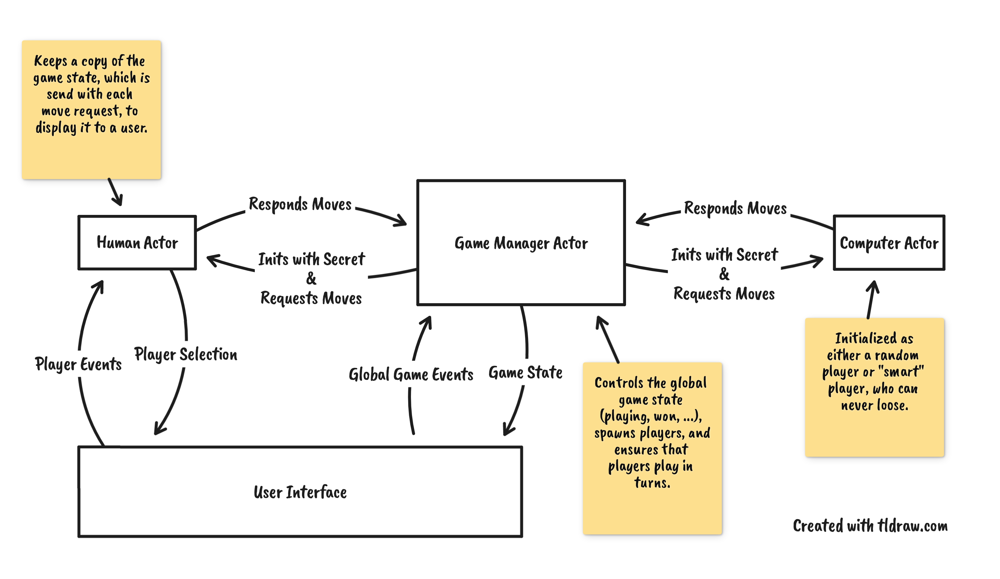
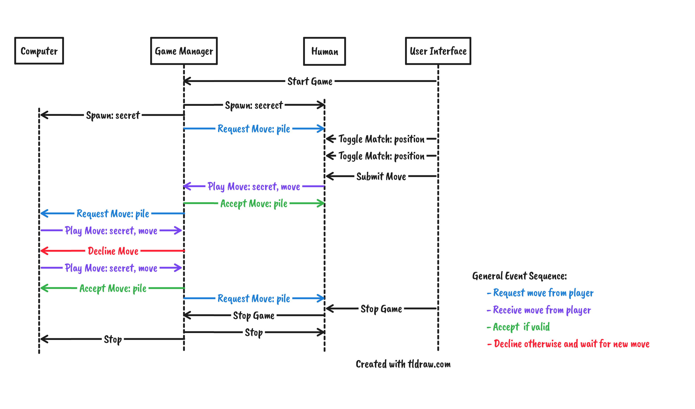

# Nim Game

> **An implementation of Nim with XState and React with a focus on the use of
> multiple actors.**

Just want to play the game? Follow [this](https://nim-game.vercel.app) link!

## Getting Started

This codebase is a common **npm** project without much surprises. After cloning,
dependencies can be installed with `npm ci` and any of the scripts below can be
invoked. Most common use cases:

- `npm start` to develop and serve with a Parcel dev server.
- `npm run build` and `npm run serve` to view a production optimized build.
- `npm test` to run unit tests
- `npm run playwright` to run e2e tests (after a build). Add
  `-- --browser=<chromium|firefox|webkit|all>` to run the tests in different
  browsers.

### Available Script

The following _npm scripts_ are defined and can be invoked with
`npm run <script>`:

| Name              | Description                                                    |
| :---------------- | :------------------------------------------------------------- |
| **start**         | Starts Parcel in dev mode to build, watch, and serve the game. |
| start:tsc         | Runs TypeScript for project-wide type errors in watch mode.    |
| **build**         | Creates an production optimized build of the game.             |
| **serve**         | Starts a webserver to serve the production build.              |
| format            | Formats the entire codebase with Prettier.                     |
| lint              | Runs TypeScript, ESLint, and Prettier checks.                  |
| **test**          | Runs unit tests with Jest.                                     |
| test:cov          | Runs unit tests and creates a coverage report.                 |
| test:watch        | Runs unit tests in watch mode.                                 |
| **playwright**    | Runs e2e tests with Playwright.                                |
| playwright:headed | Runs e2e tests in headed mode.                                 |
| playwright:debug  | Runs e2e tests with stepped debugging.                         |

## Actor Architecture

One goal of this project has been to model each entity (player and game-manager)
in the game as independent actors, with a focus on the communication between the
actors. While it makes the implementation more complex, compared to using a
single state machine, it makes it more interesting at the same time as well.

Each player is implemented as an actor which are orchestrated by a game-manager
actor. For the computer, multiple actors exist that use different decision
strategies and are chosen based on the game difficulty. The human actor is
responsible for processing user input and providing the current game state to
the user interface while a user is playing the game. The overall game state
(main menu, playing, game over) is provided by the game-manager.

Each actor can be visualized in real-time through the Stately inspector while
the game is open. The inspector can opened by clicking the toggle in the
bottom-right of the game screen.

During a game, the following communication sequence between the game-manger and
players can observed. Once the user starts a game, the game-manager spawns the
other actors. Afterwards, it requests moves from each player in turns and either
accepts their played move (if valid) or declines it. Although, given the
implementation of the players, a move should never be declined because the
players should never respond with an invalid move.

## Potential Additions to the Project

- Track the outcome of recent games and persist it in the browser. This could be
  done through a parallel state in the game-manager that loads persisted data
  and transitions when a "game over" state is entered.
- Currently, the browser tests are rather slow since they have to wait 2 seconds
  each time the computer plays a move. They could be sped up by exposing a
  global variable that changes how long computers think and could be changed
  through "page evaluations" in Playwright.
- The created actor architecture is a decent foundation to distribute the game
  between a server and clients to enable multiplayer. However, it requires
  further decoupling of the game-manager from the UI and the development of a
  preceding discovery/lobby phase to setup games between 2 players.
- The implemented tests cover all the game logic by testing the actors, as well
  as functionality of the UI through browser tests. While further React
  component tests do not add much value, they could be added to achieve 100%
  unit-test coverage.
- The game is styled with [Radix colors](https://www.radix-ui.com/colors) and
  only provides a dark mode. A light mode and toggle to switch between them
  could be added.
