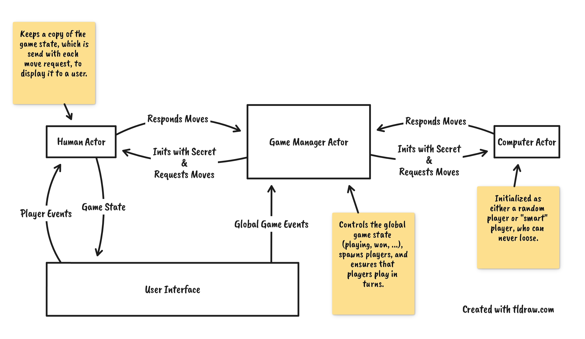

# Nim Game

> **An implementation of Nim with XState and React for my job application at
> Holisticon.**

## Actor Architecture

Each player is implemented as an actor which are orchestrated by a game-manager
actor. For the computer actor different implementation strategies exist that are
chosen based on the game difficulty. The human actor is responsible for
processing user input and providing state to the user interface while a user is
playing.

Each actor can be visualized in real-time through the Stately inspector while
the game is open.

